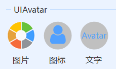
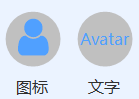
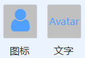

# UIAvatar
---
-  **UIAvatar** 
头像

- 默认属性：Symbol
- 默认事件：Click
- 属性列表

| 属性        | 说明     | 类型     |  默认值   |
|-----------|--------|--------|-------|
| Style | 主题样式  | UIStyle  |  Blue     |
| StyleCustomMode | 获取或设置可以自定义主题风格   | bool  | false |
| AvatarSize | 头像大小  | int  | 60 |
| Icon | 显示方式  | UIIcon |  Symbol |
| Symbol| 字体图标  | int  | 61452     |
| SymbolColor | 图标颜色  | Color  | -     |
| SymbolSize| 字体图标大小  | int  | 45 |
| Text  |获取或设置显示的文本  | string | -   | 
| Image| 图片  | Image| -|
| Shape| 显示形状  | UIShape| Circle |
| OffsetX| 水平偏移 | int  | 0|
| OffsetY| 垂直偏移 | int  | 0|
| ForeColor | 字体颜色   | Color  | -   |
| FillColor | 填充颜色   | Color  | -   |
| TagString | 获取或设置包含有关控件的数据的对象字符串   | string | -   | 
| Version | 版本  | string  |  -     |

- 字体图标   
  

  
  
-  Symbol：字体图标（int）   
  SymbolSize：字体图标的大小（int）   
  
  
  点击Symbol右侧的按钮：   
  
  
  鼠标移到图标上，显示的数字为Symbol字符，点击图标即可设置图标。    
  
  
  
- 显示方式   
  设置Icon属性   
  显示方式：图片（Image）、字体图标（Symbol）、文字（Text）   
  

  
  
- 显示形状  
  设置Shape属性   
  圆形（Circle）：   
  
  方形（Square）：   
  