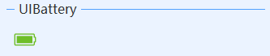
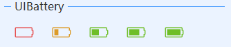

# UIBattery
---
-  **UIBattery** 
电池电量图标

- 默认属性：Power
- 默认事件：-
- 属性列表

| 属性        | 说明     | 类型     |  默认值   |
|-----------|--------|--------|-------|
| Style | 主题样式  | UIStyle  |  Blue     |
| StyleCustomMode | 获取或设置可以自定义主题风格   | bool  | false |
| Power | 电量  | int  | 100|
| ForeColor | 默认电量颜色   | Color  | -   |
| MultiColor | 根据电量显示多种颜色| bool| true|
| ColorEmpty| 电量为空颜色   | Color  | -   |
| ColorDanger|电量少时颜色   | Color  | -   |
| ColorSafe| 电量安全颜色   | Color  | -   |
| FillColor | 填充颜色   | Color  | -   |
| SymbolSize| 图标大小  | int  | 45 |
| TagString | 获取或设置包含有关控件的数据的对象字符串   | string | -   | 
| Version | 版本  | string  |  -     |

- 默认电量颜色   
  MultiColor设置为false时，显示同一色    
  

  

- 多种电量颜色    
  MultiColor设置为true时，根据电量显示多种颜色    
  
  依次为：电量为空颜色，电量少时颜色，电量安全颜色，电量安全颜色，电量安全颜色    

