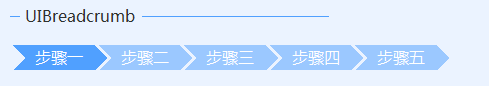

# UIBreadcrumb
---
-  **UIBreadcrumb** 
面包屑导航条。

- 默认属性：ItemIndex
- 默认事件：ItemIndexChanged
- 属性列表

| 属性        | 说明     | 类型     |  默认值   |
|-----------|--------|--------|-------|
| Style | 主题样式  | UIStyle  |  Blue     |
| StyleCustomMode | 获取或设置可以自定义主题风格   | bool  | false |
| Items |列表项 | ObjectCollection | -   | 
| ItemIndex |当前节点索引 | int|0   | 
| ItemWidth|当前节点宽度索引 | int|120   | 
| Interval|节点间隔 | int|1| 
| ForeColor | 字体颜色   | Color  | -   |
| SelectedColor| 已选节点颜色 | Color  | -   |
| UnSelectedColor| 未选节点颜色 | Color  | -   |
| TagString | 获取或设置包含有关控件的数据的对象字符串   | string | -   | 
| Version | 版本  | string  |  -     |

- 示例   
  