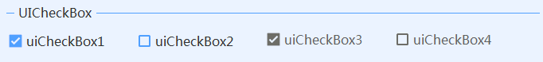

# UICheckBox
---
-  **UICheckBox** 
复选框。

- 默认属性：Checked
- 默认事件：CheckedChanged
- 属性列表

| 属性        | 说明     | 类型     |  默认值   |
|-----------|--------|--------|-------|
| Style | 主题样式  | UIStyle  |  Blue     |
| StyleCustomMode | 获取或设置可以自定义主题风格   | bool  | false |
| Checked|是否选中 | bool| false| 
| Text  |获取或设置显示的文本  | string | -   | 
| AutoSize|自动大小  | bool| true   | 
| ImageSize|图标大小 | int| 16   | 
| ImageInterval|图标与文字之间间隔| int| 3  | 
| ReadOnly|是否只读| bool| false   | 
| ForeColor | 字体颜色   | Color  | -   |
| CheckBoxColor| 填充颜色  | Color  | -   |
| TagString | 获取或设置包含有关控件的数据的对象字符串   | string | -   | 
| Version | 版本  | string  |  -     |

- 事件    
  CheckedChanged    
  public event EventHandler CheckedChanged;   
  参数sender：当前控件        

  ValueChanged   
  public delegate void OnValueChanged(object sender, bool value);    
  参数sender：当前控件    
  参数value：选中值，Checked        

  

- 示例   
  