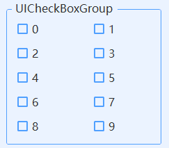

# UICheckBoxGroup
---
-  **UICheckBoxGroup** 
多选框组。

- 默认属性：Items
- 默认事件：ValueChanged
- 属性列表

| 属性        | 说明     | 类型     |  默认值   |
|-----------|--------|--------|-------|
| Style | 主题样式  | UIStyle  |  Blue     |
| StyleCustomMode | 获取或设置可以自定义主题风格   | bool  | false |
| Items  |获取该多选框组中项的集合| ObjectCollection | -   | 
| Text  |获取或设置显示的文本  | string | -   | 
| ColumnCount | 显示列的个数 | int  |  1     |
| ColumnInterval | 显示项列之间的间隔 | int  |  0    |
| RowInterval | 显示项行之间的间隔 | int  |  0    |
| ItemSize | 显示项的大小 | Size  |  150, 30     |
| StartPos | 显示项的起始位置 | Point  |  12, 12     |
| TitleTop | 标题高度 | int  |  16     |
| TitleInterval | 标题显示间隔| int  |  10     |
| TitleAlignment | 文字显示位置| HorizontalAlignment  |  Left  |
| RadiusSides | 圆角显示位置  | UICornerRadiusSides  |  All     |
| Radius | 圆角角度  | int  | 5     |
| RectSides | 边框显示位置  | ToolStripStatusLabelBorderSides  |  All     |
| TextAlign | 文字对齐方向  | ContentAlignment  |  MiddleCenter     |
| FillColor | 填充颜色   | Color  | -     |
| RectColor | 边框颜色   | Color  | -   |
| ForeColor | 字体颜色   | Color  | -   |
| FillDisableColor | 不可用时填充颜色   | Color  | -   | 
| RectDisableColor | 不可用时边框颜色   | Color  | -   | 
| ForeDisableColor | 不可用时字体颜色   | Color  | -   | 
| TagString | 获取或设置包含有关控件的数据的对象字符串   | string | -   | 
| Version | 版本  | string  |  -     |

- 事件   
  ValueChanged    
  public delegate void OnValueChanged(object sender, int index, string text, bool isChecked);      

  参数sender：当前控件   
  参数index：选中索引，SelectedIndex   
  参数text：选中项的文本   
  参数isChecked：选中项是否选中    
  
  
  
- 增加编辑项  
  选择控件属性Items，点击打开，在其中增加编辑项    

  

- 多列显示   
  设置ColumnCount=2，显示两列   
  

  

- 函数方法   
  全选: SelectAll();   
  全不选: UnSelectAll() ;   
  反选: ReverseSelected();      
  清空: Clear();   
  选中索引列表：SelectedIndexes   
  选中项列表：SelectedItems     