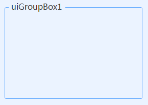

# UIGroupBox
---
-  **UIGroupBox** 
组框。

- 默认属性：Text
- 默认事件：
- 属性列表

| 属性        | 说明     | 类型     |  默认值   |
|-----------|--------|--------|-------|
| Style | 主题样式  | UIStyle  |  Blue     |
| StyleCustomMode | 获取或设置可以自定义主题风格   | bool  | false |
| Text  |获取或设置显示的文本  | string | -   | 
| TitleTop | 标题高度 | int  |  16     |
| TitleInterval | 标题显示间隔| int  |  10     |
| TitleAlignment | 文字显示位置| HorizontalAlignment  |  Left  |
| RadiusSides | 圆角显示位置  | UICornerRadiusSides  |  All     |
| Radius | 圆角角度  | int  | 5     |
| RectSides | 边框显示位置  | ToolStripStatusLabelBorderSides  |  All     |
| TextAlign | 文字对齐方向  | ContentAlignment  |  MiddleCenter     |
| FillColor | 填充颜色   | Color  | -     |
| RectColor | 边框颜色   | Color  | -   |
| ForeColor | 字体颜色   | Color  | -   |
| FillDisableColor | 不可用时填充颜色   | Color  | -   | 
| RectDisableColor | 不可用时边框颜色   | Color  | -   | 
| ForeDisableColor | 不可用时字体颜色   | Color  | -   | 
| TagString | 获取或设置包含有关控件的数据的对象字符串   | string | -   | 
| Version | 版本  | string  |  -     |

- 示例    
  
