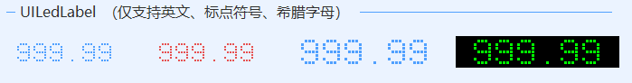

# UILedLabel
---
-  **UILedLabel** LED标签。    
 **注：仅支持英文、数字、标点符号、希腊字母，不支持中文** 

- 默认属性：Text
- 默认事件：Click
- 属性列表

| 属性        | 说明     | 类型     |  默认值   |
|-----------|--------|--------|-------|
| Style | 主题样式  | UIStyle  |  Blue     |
| StyleCustomMode | 获取或设置可以自定义主题风格   | bool  | false |
| Text  |获取或设置显示的文本  | string | -   | 
| BackColor | 背景颜色   | Color  | -   |
| ForeColor | 字体颜色   | Color  | -   |
| IntervalIn | LED亮块间距 | int  | 1 |
| IntervalOn | LED亮块大小 | int  | 2 |
| TagString | 获取或设置包含有关控件的数据的对象字符串   | string | -   | 
| Version | 版本  | string  |  -     |

- 示例   
  