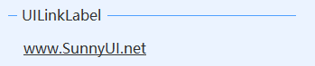

# UILinkLabel
---
-  **UILinkLabel** 
表示可显示超链接的标签控件。

- 默认属性：Text
- 默认事件：Click
- 属性列表

| 属性        | 说明     | 类型     |  默认值   |
|-----------|--------|--------|-------|
| Style | 主题样式  | UIStyle  |  Blue     |
| StyleCustomMode | 获取或设置可以自定义主题风格   | bool  | false |
| Text  |获取或设置显示的文本  | string | -   | 
| ForeColor | 字体颜色   | Color  | -   |
| ActiveLinkColor  | 获取或设置用来显示活动链接的颜色。 | Color  | -   |
| LinkColor | 获取或设置显示普通链接时使用的颜色。 | Color  | -   |
| VisitedLinkColor  | 获取或设置当显示以前访问过的链接时所使用的颜色。 | Color  | -   |
| TagString | 获取或设置包含有关控件的数据的对象字符串   | string | -   | 
| Version | 版本  | string  |  -     |

- 示例    
  