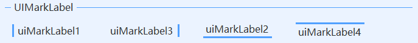

# UIMarkLabel
---
-  **UIMarkLabel** 
带颜色标签。

- 默认属性：Text
- 默认事件：Click
- 属性列表

| 属性        | 说明     | 类型     |  默认值   |
|-----------|--------|--------|-------|
| Style | 主题样式  | UIStyle  |  Blue     |
| StyleCustomMode | 获取或设置可以自定义主题风格   | bool  | false |
| Text  |获取或设置显示的文本  | string | -   |
| AutoSize| 自动大小  | bool  |  true |
| ForeColor | 字体颜色   | Color  | -   |
| MarkSize | 标签大小  | int  | 3 |
| MarkPos | 标签位置  | UIMarkPos | Left |
| MarkColor | 标签颜色   | Color  | -   |
| TagString | 获取或设置包含有关控件的数据的对象字符串   | string | -   | 
| Version | 版本  | string  |  -     |

- 标签位置    
  标签有四个显示位置，左、右、下、上，见下图：    
  