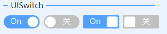

# UISwitch
---
-  **UISwitch** 开关。

- 默认属性：Active
- 默认事件：ValueChanged

- 属性列表

| 属性        | 说明     | 类型     |  默认值   |
|-----------|--------|--------|-------|
| Style | 主题样式  | UIStyle  |  Blue     |
| StyleCustomMode | 获取或设置可以自定义主题风格   | bool  | false |
| Active| 是否打开   | bool  | false |
| ActiveText| 打开文字   | string| 开 |
| InActiveText| 关闭文字   | string| 关 |
| ActiveColor| 打开颜色  | Color| - |
| InActiveColor| 关闭颜色  | Color| Silver |
| ButtonColor| 填充颜色  | Color| White |
| SwitchShape| 开关形状   | UISwitchShape| Round   |
| ForeColor | 字体颜色   | Color  | -   |
| TagString | 获取或设置包含有关控件的数据的对象字符串   | string | -   | 
| Version | 版本  | string  |  -     |

- 事件   
  ValueChanged   
  public delegate void OnValueChanged(object sender, bool value);    
  参数sender：当前控件   
  参数value：选中值，active    

  

- 开关状态   
  
  设置Active属性，状态切换通过ValueChanged输出    

  

- 开关形状   
  SwitchShape：Round为圆角开关，Square为方角开关    