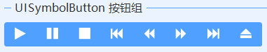
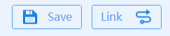

# UISymbolButton
---
-  **UISymbolButton** 
字体图标按钮

- 默认属性：Text
- 默认事件：Click
- 属性列表

| 属性        | 说明     | 类型     |  默认值   |
|-----------|--------|--------|-------|
| Style | 主题样式  | UIStyle  |  Blue     |
| StyleCustomMode | 获取或设置可以自定义主题风格   | bool  | false |
| Text  |获取或设置显示的文本  | string | -   | 
| RadiusSides | 圆角显示位置  | UICornerRadiusSides  |  All     |
| Radius | 圆角角度  | int  | 5     |
| RectSides | 边框显示位置  | ToolStripStatusLabelBorderSides  |  All     |
| Symbol| 字体图标  | int  | 61452     |
| SymbolSize| 字体图标大小  | int  | 24     |
| Image| 图片| Image| -    |
| ImageAlign| 图片放置位置  | ContentAlignment| MiddleCenter   |
| ImageInterval| 图片文字间间隔  | int  | 2|
| IsCircle| 是否是圆形  | bool   |  false |
| CircleRectWidth| 圆形边框大小  | int  | 1|
| TextAlign | 文字对齐方向  | ContentAlignment  |  MiddleCenter     |
| Selected  | 是否选中   | bool   |  false |
| FillColor | 填充颜色   | Color  | -     |
| RectColor | 边框颜色   | Color  | -   |
| ForeColor | 字体颜色   | Color  | -   |
| FillDisableColor | 不可用时填充颜色   | Color  | -   | 
| RectDisableColor | 不可用时边框颜色   | Color  | -   | 
| ForeDisableColor | 不可用时字体颜色   | Color  | -   | 
| FillHoverColor | 鼠标移上时填充颜色   | Color  | -   | 
| RectHoverColor | 鼠标移上时边框颜色   | Color  | -   | 
| ForeHoverColor | 鼠标移上时字体颜色   | Color  | -   | 
| FillPressColor | 鼠标按下时填充颜色   | Color  | -   | 
| RectPressColor | 鼠标按下时边框颜色   | Color  | -   | 
| ForePressColor | 鼠标按下时字体颜色   | Color  | -   | 
| FillSelectedColor | 选中时填充颜色   | Color  | -   | 
| ForeSelectedColor | 选中时字体颜色   | Color  | -   | 
| RectSelectedColor | 选中时边框颜色   | Color  | -   | 
| DialogResult | 指定标识符以指示对话框的返回值   | DialogResult  |  None     |
| ShowFocusLine | 显示激活时边框线   | bool  | false    |
| ShowTips  | 是否显示角标 | bool   |  false |
| TipsText  | 角标文字   | string | -   | 
| TipsFont  | 角标文字字体 | Font   | -   | 
| TipsColor | 角标文字颜色 | Color  | Red   |
| TagString | 获取或设置包含有关控件的数据的对象字符串   | string | -   | 
| Version | 版本  | string  |  -     |
| UseDoubleClick | 是否启用双击事件  | bool  |false     |

- 字体图标
  

  
  
- Symbol：字体图标（int）   
   SymbolSize：字体图标的大小（int）   
   

   点击Symbol右侧的按钮：   
   

   鼠标移到图标上，显示的数字为Symbol字符，点击图标即可设置图标。    

   

- 圆形按钮   
  
  设置IsCircle为true，可设置CircleRectWidth边框大小    

  

- 按钮组   
  
  设置左侧按钮显示左边两个圆角(RadiusSides:LeftTop, LeftBottom)，   
  设置中间的按钮(RadiusSides:None)   
  设置右侧按钮显示左边两个圆角(RadiusSides:RightTop, RightBottom)    

  

- 自定义图片   
  
  设置Image属性    

  

- 字体图标不居中显示   
  因为字体图标不是等宽和等高的，会存在不居中的现象   
  设置ImageAlign:TopLeft，然后设置Padding的Left和Top属性，例如5,5,0,0    