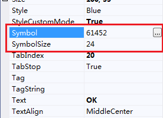
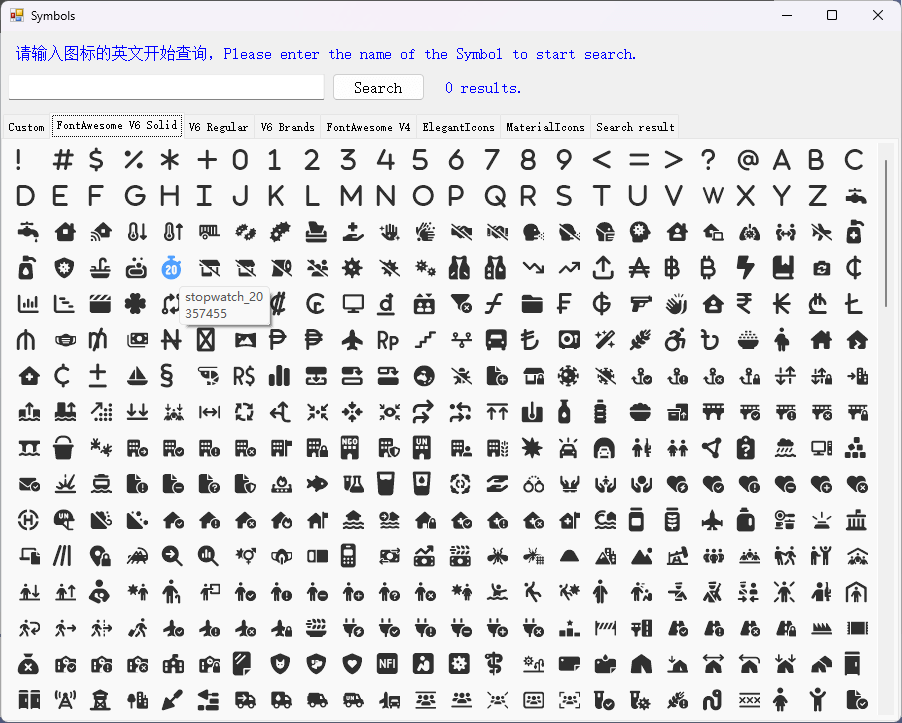

# UISymbolLabel
---
-  **UISymbolLabel** 
字体图标标签

- 默认属性：Text
- 默认事件：Click
- 属性列表

| 属性        | 说明     | 类型     |  默认值   |
|-----------|--------|--------|-------|
| Style | 主题样式  | UIStyle  |  Blue     |
| StyleCustomMode | 获取或设置可以自定义主题风格   | bool  | false |
| Text  |获取或设置显示的文本  | string | -   | 
| AutoSize| 自动大小  | bool  |  true |
| Symbol| 字体图标  | int  | 61452     |
| SymbolColor | 图标颜色  | Color  | -     |
| SymbolSize| 字体图标大小  | int  | 24     |
| ImageInterval| 图标和文字间间隔 | int  | 2|
| TextAlign | 文字对齐方向  | ContentAlignment  |  MiddleCenter     |
| ForeColor | 字体颜色   | Color  | -   |
| TagString | 获取或设置包含有关控件的数据的对象字符串   | string | -   | 
| Version | 版本  | string  |  -     |

- 字体图标   
  

  

- Symbol：字体图标（int）  
   SymbolSize：字体图标的大小（int）   
   

   点击Symbol右侧的按钮：   
   

   鼠标移到图标上，显示的数字为Symbol字符，点击图标即可设置图标。

 