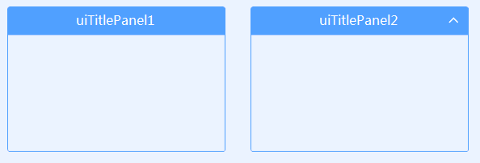

# UITitlePanel
---
-  **UITitlePanel** 
带标题面板。

- 默认属性：Text
- 默认事件：
- 属性列表

| 属性        | 说明     | 类型     |  默认值   |
|-----------|--------|--------|-------|
| Style | 主题样式  | UIStyle  |  Blue     |
| StyleCustomMode | 获取或设置可以自定义主题风格   | bool  | false |
| Text  |获取或设置显示的文本  | string | -   | 
| ShowCollapse | 是否打开缩放按钮 | bool  |  false     |
| Collapsed | 是否缩放 | bool  |  false     |
| TitleHeight | 面板高度 | int  |  35     |
| TitleInterval |标题文字局左或者局右时与边框距离| int  |  10     |
| TitleAlign | 文字显示位置| HorizontalAlignment  |  Center  |
| RadiusSides | 圆角显示位置  | UICornerRadiusSides  |  All     |
| Radius | 圆角角度  | int  | 5     |
| RectSides | 边框显示位置  | ToolStripStatusLabelBorderSides  |  All     |
| TextAlign | 文字对齐方向  | ContentAlignment  |  MiddleCenter     |
| TitleColor | 标题颜色   | Color  | -     |
| FillColor | 填充颜色   | Color  | -     |
| RectColor | 边框颜色   | Color  | -   |
| ForeColor | 字体颜色   | Color  | -   |
| FillDisableColor | 不可用时填充颜色   | Color  | -   | 
| RectDisableColor | 不可用时边框颜色   | Color  | -   | 
| ForeDisableColor | 不可用时字体颜色   | Color  | -   | 
| TagString | 获取或设置包含有关控件的数据的对象字符串   | string | -   | 
| Version | 版本  | string  |  -     |

- 其他   
  **标题栏高度内不可放置其他控件。**     

  如果其中放入其他控件，并设置Dock为Fill时，遮挡标题栏，可设置Padding.Top属性    

  

- 示例
  
