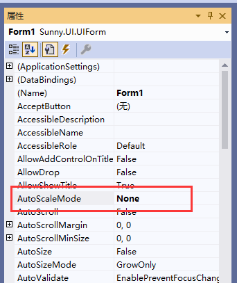
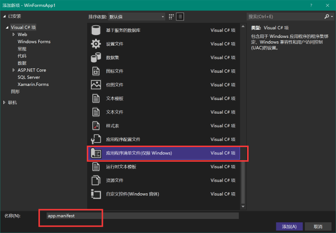
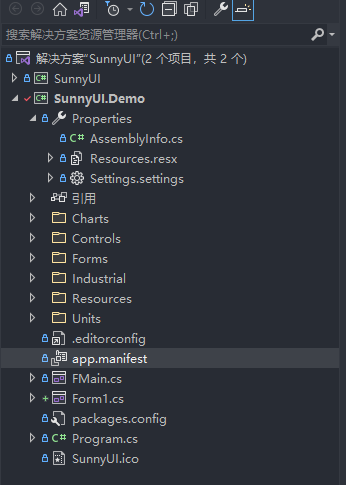
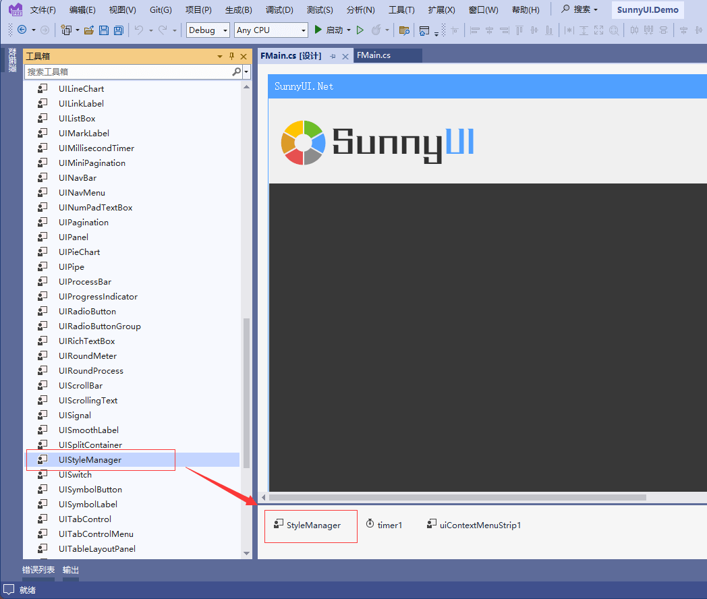
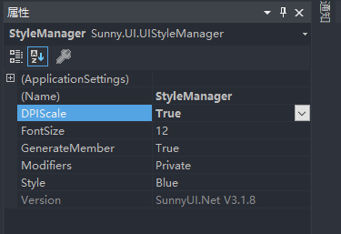

# DPI缩放自适应方案

---

Winform窗体随着屏幕的DPI缩放，会引起窗体变形及字体变形。
SunnyUI的DPI缩放自适应方案目标为随着DPI缩放，窗体和字体均不变形，从而实现界面的美观。
主要有以下三步操作：

1、设置窗体和自定义用户控件的AutoScaleMode为None
实现目标：禁止窗体因为字体大小缩放变形    
因为显示的高分屏，然后操作系统的设置了字体缩放引起的。窗体默认的AutoScaleMode = Font，控件会因为高分屏自动缩放。
解决方法：设置窗体、用户控件的AutoScaleMode = None 

当前版本的UIForm、UIPage和UIUserControl的AutoScaleMode都已经默认设置为None，需要注意的是用户的自定义用户控件UserControl需要设置此属性。

2、设置app.manifest的dpiAware为true
实现目标：禁止窗体因为DPI缩放变形
右键工程,添加应用程序清单 app.manifest, 文件名用默认,修改

这时候项目的文件里就多了app.manifest

取消这段的注释，按下面代码修改，打开感知DPI，启用dpiAware     

~~~
  <!-- 指示该应用程序可感知 DPI 且 Windows 在 DPI 较高时将不会对其进行
       自动缩放。Windows Presentation Foundation (WPF)应用程序自动感知 DPI，无需
       选择加入。选择加入此设置的 Windows 窗体应用程序(面向 .NET Framework 4.6)还应
       在其 app.config 中将 "EnableWindowsFormsHighDpiAutoResizing" 设置设置为 "true"。
       
       将应用程序设为感知长路径。请参阅 https://docs.microsoft.com/windows/win32/fileio/maximum-file-path-limitation -->

  <application xmlns="urn:schemas-microsoft-com:asm.v3">
    <windowsSettings>
      <dpiAware xmlns="http://schemas.microsoft.com/SMI/2005/WindowsSettings">true</dpiAware>
      <longPathAware xmlns="http://schemas.microsoft.com/SMI/2016/WindowsSettings">true</longPathAware>
    </windowsSettings>
  </application>

  <!-- 启用 Windows 公共控件和对话框的主题(Windows XP 和更高版本) -->
  <!--
~~~

3、设置DPIScale为true
实现目标：DPI缩放后字体大小不变
**确认编译时DPI缩放为100%** 
在主窗体上放置UIStyleManager控件

设置DPIScale为true

在确认 **编译时屏幕的DPI缩放为100%情况下** 编译程序，在不同的DPI缩放下测试编译好的[SunnyUI.Demo.exe](https://gitee.com/yhuse/SunnyUI.Demo)