# 常见问题
---
开始使用SunnyUI前，请先浏览一遍常见问题

##   更新了V3.5.0+版本后，界面字体不一致怎么办    

按文档设置全局字体：
[全局字体设置](/globalfont)    

##  我把一个窗体继承UIForm，IsMdiContainer这个不能设置为true，无法变为容器     
  SunnyUI有自己的多页面框架，不支持MDI。    

##  从码云下载下来的项目，编译直接出错嘛，怎么办？
  兄弟，先把码云项目下面的Readme.md仔细看看：
  SunnyUI.Net, 是基于.Net Framework 4.0+、.Net 5、.Net 6 框架的 C# WinForm 开源控件库、工具类库、扩展类库、多页面开发框架。
  **源码编译环境：** 
  **VS2022**，V3.0.9增加了.Net6的支持，所以编译需要VS2022。    
  安装.NetFramework4.0目标包的方法见：[https://www.cnblogs.com/yhuse/p/15536393.html](https://www.cnblogs.com/yhuse/p/15536393.html)    
  **动态库应用环境：**
  **VS2010及以上**，应用开发时直接引用Dll，.Net Framework 4.0及以上（不包括.Net Framework 4 Client Profile）都可以。    
  未识别TargetFramework值“net5.0-windows”，就是因为VS版本低了，.Net5只有VS2019 16.8+以上才能运行    
  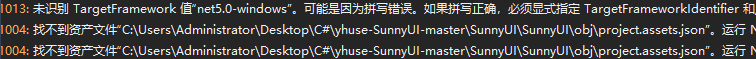

  未识别TargetFramework值“net6.0-windows”，就是因为VS版本低了，.Net6只有VS2022 17.0+以上才能运行    

##  打开源码，显示依赖项都是感叹号    
  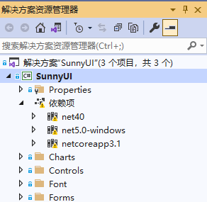

##  有可能是因为网络原因，连不上Nuget服务器，通过设置Nuget源为国内源即可。
  Nuget包管理器，设置程序包源：https://nuget.cdn.azure.cn/v3/index.json
  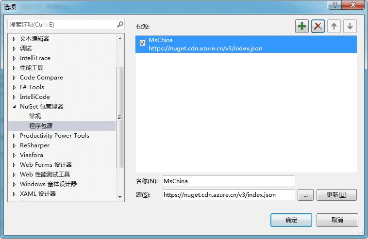

##  界面的一些小图标的数字代号，是什么意思啊？
  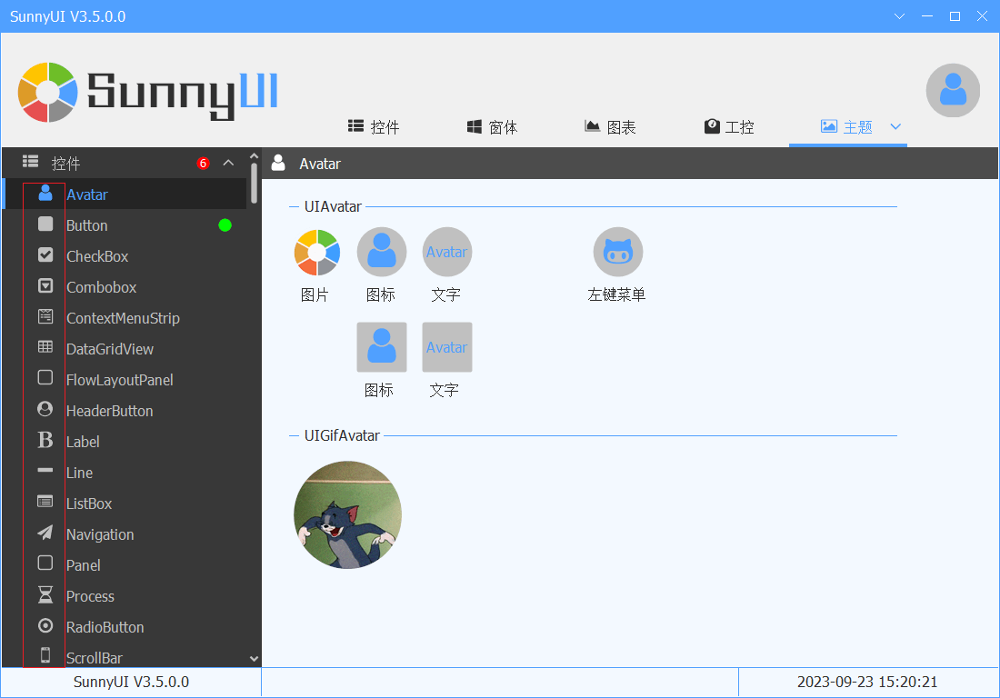

  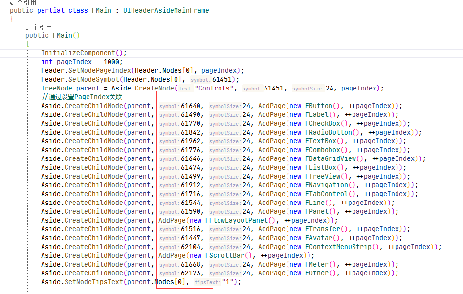

  对，就是图上框框里的图标和魔法数字，其实用的是WEB开发常见的字体图标，详见介绍：
  [字体图标](/symbol)

##  为什么有些控件，我改了颜色，编辑时的界面显示了，然后一编译运行，颜色就变了？
  因为SunnyUI是带[**主题**](/theme) 风格的，有统一的主题风格控件UIStyleManager来控制主题颜色。
  所以你自己改的颜色在运行时被主题颜色覆盖了。
  那有同学要问了，我就是要自己设置颜色，有没有方法呢？
  有的，SunnyUI也帮你考虑了。
  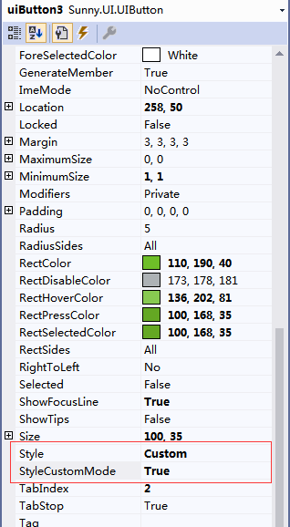

##  就是更改颜色后，把控件的Style设置为Custom，StyleCustomMode设置为True
  StyleCustomMode就是接受用户自定义颜色的意思。

##  控件属性那么多，SunnyUI到底怎么用呢？
  具体控件怎么用，主要还是看控件的属性，除了控件的原生属性外
  SunnyUI已经将添加的属性进行了分类，分类的标题就是SunnyUI
  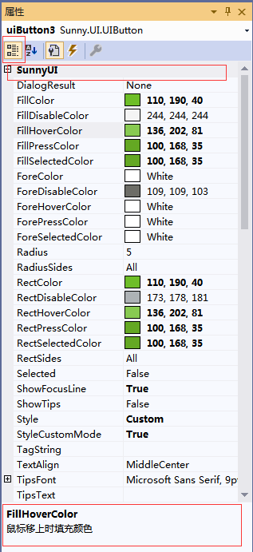

  点击控件分类，选择SunnyUI类目下的属性，在页脚会有属性的说明。

##  为什么继承的窗体，上面有小锁，能解开吗，还有就是继承的窗体，有些控件属性都设置不了，怎么办？
  首先得了解窗体继承的概念，和类的继承是差不多的，窗体上有小锁的其实就是类似于类继承中父类的某个Private属性
  为了保证继承窗体的UI设计，上面的某些控件是不让修改和移动的，所以有锁。
  在使用时，父窗体一般都将其所用的控件的属性和事件进行了封装，可以正常使用。
  举例：
  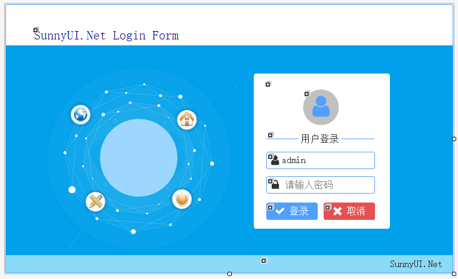

  继承的登录窗体的登录按钮有锁，但其点击事件已封装到父类的事件
  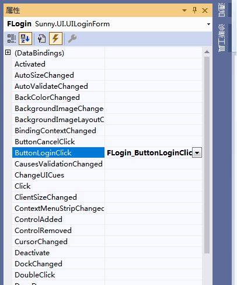

##  为什么运行时的界面显示比设计期的大？
  设计期：
  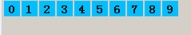

  运行期：
  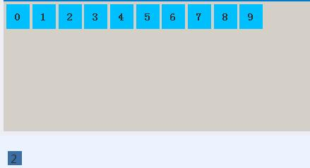

  引起界面放大的原因主要又两个，一是因为界面跟随字体放大，二是界面跟随屏幕的DPI缩放引起的。

  1. 因为显示的高分屏，然后操作系统的设置了字体缩放引起的。窗体默认的AutoScaleMode = Font，控件会因为高分屏自动缩放。

    解决方法：设置窗体、用户控件的AutoScaleMode = None 
  2. 设置app.manifest的dpiAware为true
   ~~~
  <application xmlns="urn:schemas-microsoft-com:asm.v3">
    <windowsSettings>
      <dpiAware xmlns="http://schemas.microsoft.com/SMI/2005/WindowsSettings">true</dpiAware>
      <longPathAware xmlns="http://schemas.microsoft.com/SMI/2016/WindowsSettings">true</longPathAware>
    </windowsSettings>
  </application>
   ~~~
  3. 上述两步能解决窗体或者控件的缩放，但是DPI缩放时，字体在有些操作系统下并未跟随缩放。 **在保证编译时DPI缩放为100%** ，参照Demo的FMain，将StyleManager的DPIScale设置为True。
  4. 详细操作步骤见：[DPI缩放自适应方案](/dpi)

##  工具箱找不到UILogo控件，怎么用？
  UILogo是为SunnyUI定制的，未加入工具箱，有需要的在其位置放置一张图片即可。

##  框架页面切换时，每次要重新刷新页面的解决方法？
  参考Demo的FButton.cs  
  放在 [窗体Load、重载OnLoad、重载Init] 的内容每次页面切换都会执行。这三个选一个用就行了。  

~~~
        /// <summary>
        /// 放在 [窗体Load (NeedReload = true)] 的内容每次页面切换，进入页面都会执行。
        /// 这三个选一个用就行了。
        /// </summary>
        /// <param name="sender"></param>
        /// <param name="e"></param>
        private void FButton_Load(object sender, EventArgs e)
        {
            Console.WriteLine("1. FButton_Load");
        }

        //放在 [窗体Load (NeedReload = true)] 的内容每次页面切换，进入页面都会执行。
        protected override void OnLoad(EventArgs e)
        {
            base.OnLoad(e);
            Console.WriteLine("3. FButton_OnLoad");
        }

        //放在 [重载Init] 的内容每次页面切换，进入页面都会执行。
        public override void Init()
        {
            base.Init();
            uiSwitch1.Active = uiSwitch4.Active = true;
            uiSwitch2.Active = uiSwitch3.Active = false;

            Console.WriteLine("2. FButton_Init");
        }

        //放在 [Final] 的内容每次页面切换，退出页面都会执行
        public override void Final()
        {
            base.Final();
            Console.WriteLine("4. FButton_Final");
        }
~~~

##  把控件从工具箱往界面上拖到时候的解决方法  
  如图所示  
  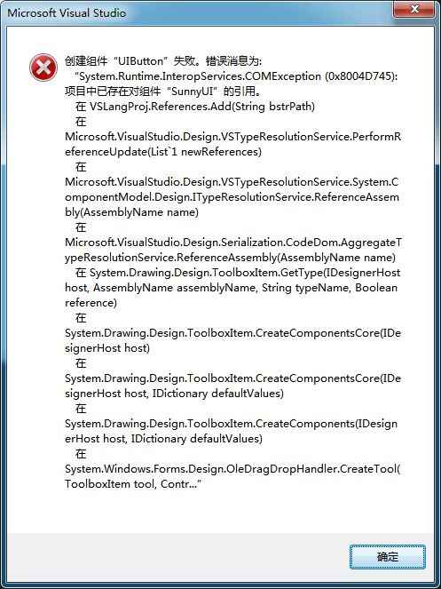

  原因是工具箱里的控件和项目引用的控件的版本不一致  
  解决方法是把工具箱里的控件删除，重建添加，然后再拖放到窗体。  

##  高清屏下字体模糊的解决方法  
  今天就遇到了之前遇到过的一个问题，那就是WinForm在高分辨率下界面模糊。我的开发环境是Windows10 64位和VS2010，电脑屏幕分辨率为1920*1080，采用的是WinForm程序设计方法开发。在程序运行时遇到了这样一个问题，在VS设计的很清晰的菜单和界面，运行的时候菜单和控件上字体变得很模糊，界面大小也发生了变化。于是上网寻求解决办法，网友给出的解决方案有以下3种。  
  1、这里是列表文本WinForm对高分屏的支持不好，用WPF程序设计可以解决该问题。(这是一个可行的办法，但是短期内较好的掌握WPF，并用WPF技术重现实现软件不太现实）  
  2、更改窗体的AutoScaleMode属性为Font,并在窗体的构造函数中增加两行代码调整窗体上字体的大小。本人反复尝试，该方法行不通。  
  3、更改程序的配置文件，在里面添加几行代码，使程序运行时自动检测屏幕分辨率，在高分屏时禁用系统缩放。  
  第三种方案的解决思路是正确的，就是要检测屏幕的分辨率，高分屏时禁用系统的缩放，因为现在Win10 高分屏默认字体放大125，这样会导致我们在程序中设计好的界面字体模糊。  
  具体步骤：  
  1、选择当前项目，单击鼠标右键，选择【添加】|【类】；  
  2、选择【应用程序清单文件】；  
  3、打开刚才建立的清单文件，添加下面的代码 
  4、保存运行，发现修复了界面模糊问题。  
```
<application xmlns="urn:schemas-microsoft-com:asm.v3">
  <windowsSettings>
    <dpiAware xmlns="http://schemas.microsoft.com/SMI/2005/WindowsSettings">true</dpiAware>
  </windowsSettings>
</application>
```
  PS：有时候按照上面步骤可能不成功，关掉程序重新打开运行后发现分辨率已协调，亲测有效。  
  另外还是建议设置窗体、用户控件的AutoScaleMode = None  

##  SunnyUI.dll 中没有可放置在工具箱上的组件。
  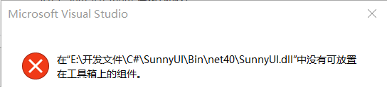

  请检查是否项目的.NetFramework环境为：.Net Framework 4 Client Profile  
  动态库应用环境：**VS2010及以上** ，.Net Framework 4.0及以上（**不包括.Net Framework 4 Client Profile**)  

##  .Net5、.Net6的Winform编辑器相关问题    
  UINavBar报错    
  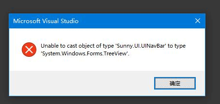

  Symbol没有右侧的点击按钮    
  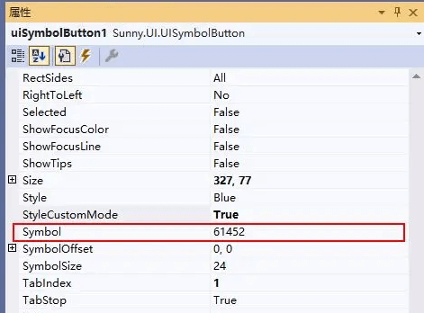

可参考 https://github.com/dotnet/winforms/issues/6193
建议将项目的运行环境换成.NetFramework。

##  未能加载程序集    
  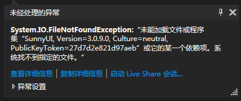

  VS提醒的这么明确，少啥加啥呗，一共两个文件：        
  **最好的做法是从Nuget引用SunnyUI**    
  或者直接引用已经编译好两个的Dll（SunnyUI.dll，SunnyUI.Common.dll)    
  有时候VS也会抽风，明明已经引用类两个dll，还是提示少引用。那就把这两个引用都删除，再重新引用。    

##  文件中的类都不能进行设计，因此未能为该文件显示设计器...
  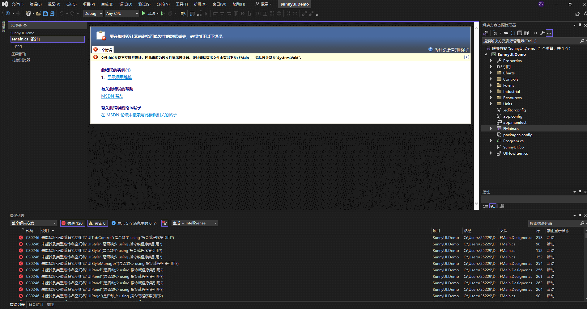

  确认编译环境符合项目说明
  确认已经引用了SunnyUI控件，nuget引用没有黄色感叹号
  清理项目，重新编译，关掉VS，再重新打开VS。一般能解决此问题。