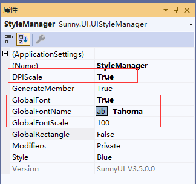

# 全局字体设置

---

SunnyUI 默认字体为系统默认字体(V3.5.0)，可以设置全局字体，包括字体样式和字体缩放大小。

具体操作步骤如下    
1、按DPI缩放自适应解决方案设置    
[DPI缩放自适应方案](/dpi)

2、设置全局字体及字体缩放

设置DPIScale为true。    
设置GlobalFont为true。    
设置GlobalFontName，这是全局字体名称，可下拉选择。    
设置GlobalFontScale，这是全局字体缩放大小比例，SunnyUI 默认字体大小为12，缩放比例默认100%。
    例如想设置字体大小为9，设置缩放比例为75
    例如想设置字体大小为15，设置缩放比例为125

3、运行时设置全局字体及字体缩放
见Demo的多彩主题

~~~
            UIStyles.DPIScale = true;
            UIStyles.GlobalFont = true;
            UIStyles.GlobalFontName = cbFont.Text;
            UIStyles.GlobalFontScale = uiTrackBar1.Value;
            UIStyles.SetDPIScale();
~~~