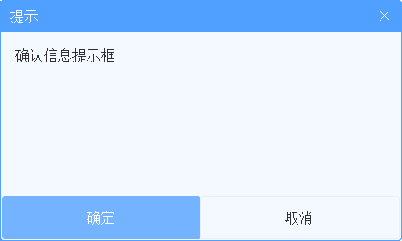
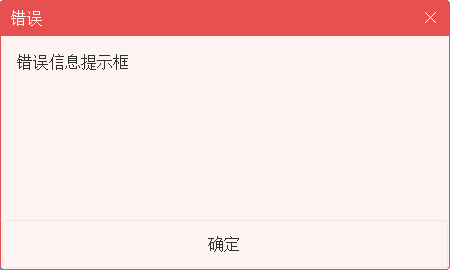
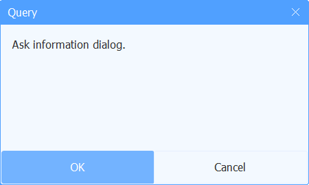
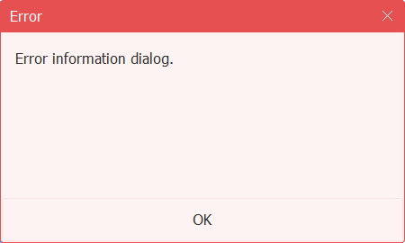

# 国际化

---

SunnyUI控件内部默认使用中文，若希望使用其他语言，则需要进行多语言设置。
  **本页面所描述的国际化是针对SunnyUI内的按钮、标题等中文资源的国际化** 
  **如您开发的系统需要做国际化请自行开发。** 

  常用的按钮、标题、提示等文字已经设置为静态字符串变量，存于ULocalize.cs文件中。

```
public static class UILocalize
{
    public static string InfoTitle = "提示";
    public static string SuccessTitle = "正确";
    public static string WarningTitle = "警告";
    public static string ErrorTitle = "错误";
    public static string AskTitle = "提示";
    public static string InputTitle = "输入";
    public static string CloseAll = "全部关闭";
    public static string OK = "确定";
    public static string Cancel = "取消";
    public static string GridNoData = "[ 无数据 ]";
    public static string GridDataLoading = "数据加载中 ......";
    public static string GridDataSourceException = "数据源必须为DataTable或者List";
}
```

  可以重写UILocalize类静态变量值来改变语言。
  UILocalizeHelper类已经包含中文和英文的默认配置函数：

```
public static class UILocalizeHelper
    {
        public static void SetEN()
        {
            UILocalize.InfoTitle = "Info";
            UILocalize.SuccessTitle = "Success";
            UILocalize.WarningTitle = "Warning";
            UILocalize.ErrorTitle = "Error";
            UILocalize.AskTitle = "Query";
            UILocalize.InputTitle = "Input";
            UILocalize.CloseAll = "Close all";
            UILocalize.OK = "OK";
            UILocalize.Cancel = "Cancel";
            UILocalize.GridNoData = "[ No data ]";
            UILocalize.GridDataLoading = "Data loading ......";
            UILocalize.GridDataSourceException = "The data source must be DataTable or List";
        }

        public static void SetCH()
        {
            UILocalize.InfoTitle = "提示";
            UILocalize.SuccessTitle = "正确";
            UILocalize.WarningTitle = "警告";
            UILocalize.ErrorTitle = "错误";
            UILocalize.AskTitle = "提示";
            UILocalize.InputTitle = "输入";
            UILocalize.CloseAll = "全部关闭";
            UILocalize.OK = "确定";
            UILocalize.Cancel = "取消";
            UILocalize.GridNoData = "[ 无数据 ]";
            UILocalize.GridDataLoading = "数据加载中 ......";
            UILocalize.GridDataSourceException = "数据源必须为DataTable或者List";
        }
    }
```

  如需要其他语言，则在自己程序里写函数更新UILocalize类静态变量值即可。
  显示效果如下：
  **中文：** 





  **英文：** 




