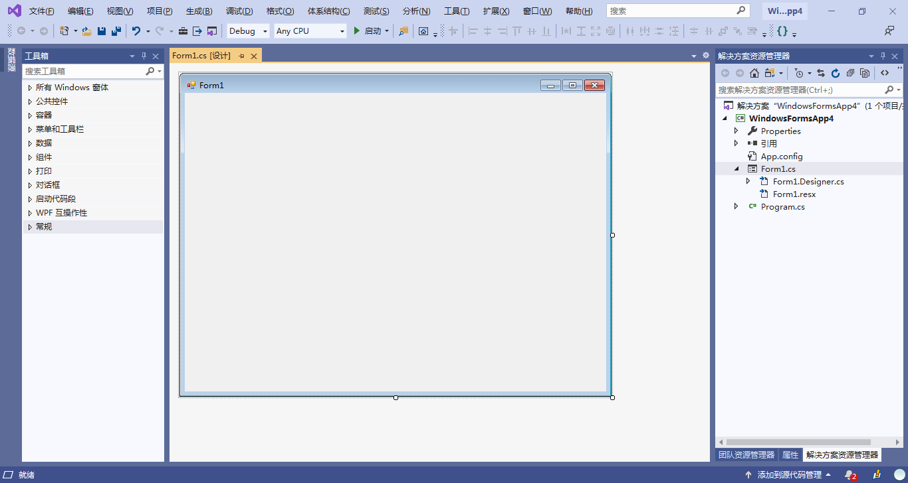
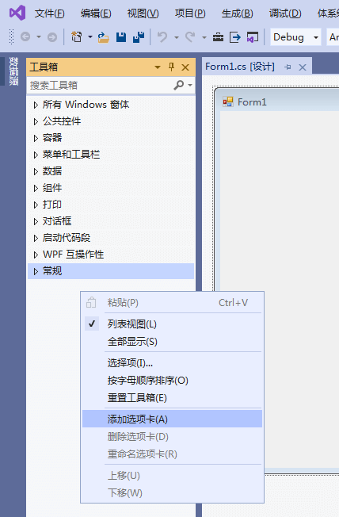
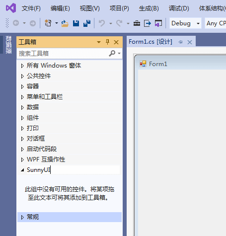
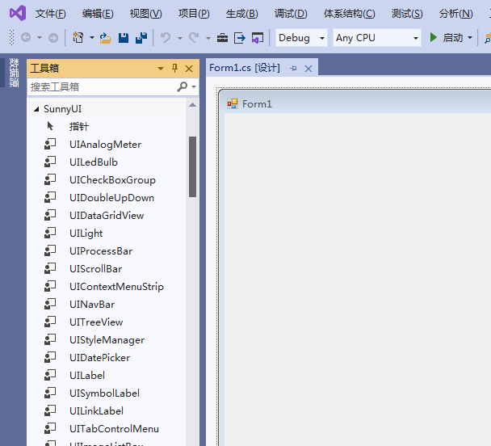
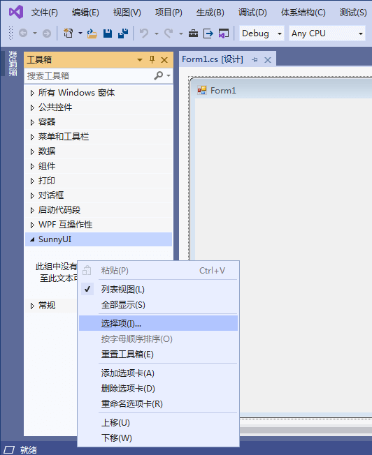
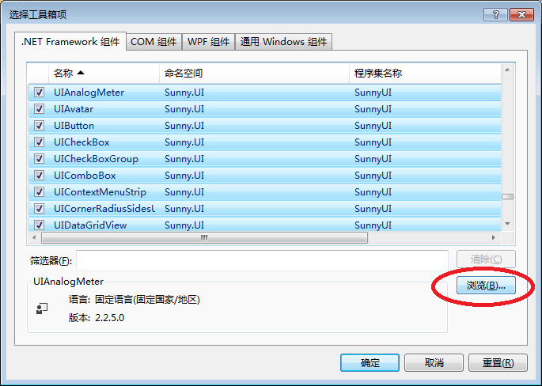

# 安装
---
- **1、Nuget安装** 
  Nuget安装是Visual Studio引用控件包最方便快捷的方法。    
   **推荐使用该方法，通过Nuget引用安装后，工具箱会自动添加SunnyUI控件。** 

  安装方法一：通过PM命令安装： 
  PM>`Install-Package SunnyUI`
  
  安装方法二：通过Nuget包管理器搜索SunnyUI安装：
  

  
  
- **2、下载安装** 
  3.6.8之前，打开SunnyUI的码云地址：[https://gitee.com/yhuse/SunnyUI](https://gitee.com/yhuse/SunnyUI)

  3.6.8之后，下载路径为: [SunnyUI.Demo.exe](https://gitee.com/yhuse/SunnyUI.Demo)
  
  点击“克隆/下载”，点击“下载ZIP”，根据提示下载SunnyUI。
  
  
  
  
  下载yhuse-SunnyUI-master.zip，然后解压，直接引用已经编译好的dll文件，
  路径为SunnyUI\SunnyUI.Demo\Bin\SunnyUI.dll，SunnyUI\SunnyUI.Demo\Bin\SunnyUI.Common.dll，这两个项目都必须引用。再说一句，还是推荐nuget引用。
  
  新建Winform项目或者打开您已有的Winform项目，选择窗体，显示窗体设计器界面，
  
  点击“视图”-“工具箱”，显示工具箱，如下图：
  
  
  
  
  在工具箱，点击鼠标右键，添加选项卡
  
  
  
  
  输入SunnyUI
  
  
  
  
  在工具箱中选中选中SunnyUI选项卡。
  
- 安装方法一：
  根据提示“此组中没有可用的控件。将某项拖至此文本可将其添加到工具箱”，
  拖动SunnyUI\SunnyUI.Demo\Bin\SunnyUI.dll到提示文字，会自动安装SunnyUI控件。
  

  
  
- 安装方法二：
  点击鼠标右键，选择项
  

  
  
  在“.NET Framework 组件”页面，点击“浏览”，选择SunnyUI\SunnyUI.Demo\Bin\SunnyUI.dll
  
  
  
  
  点击确定按钮，将SunnyUI组件增加到选项卡
  
  
  
  
  好的，安装完成了，开始使用SunnyUI控件吧！~