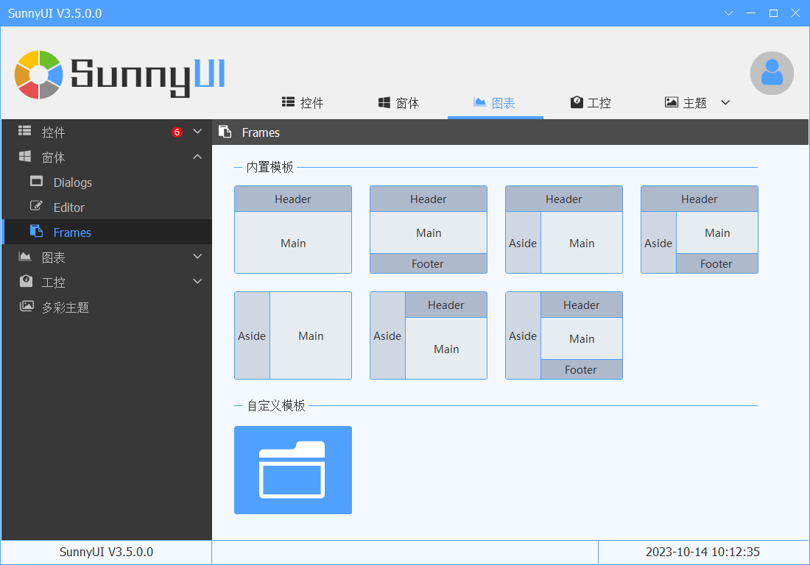
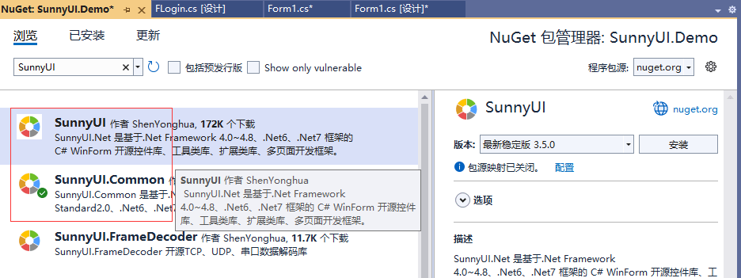
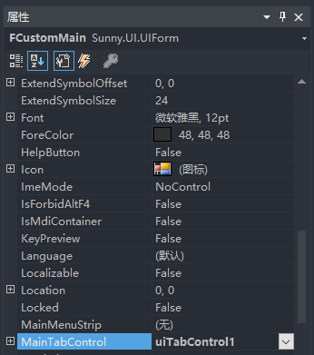
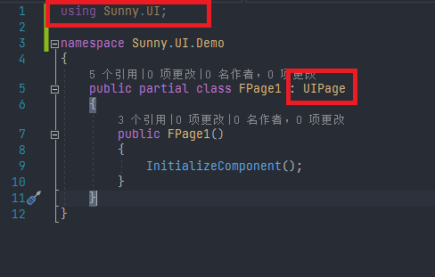
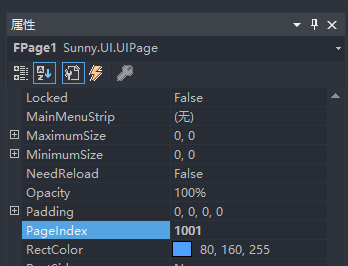

# 快速开始
---
- SunnyUI多页面框架由框架和页面构成。    
最基本的实现是框架（IFrame）由UIForm实现，页面由（UIPage）实现。    
在UIForm放置一个UITabControl，将多个UIPage放置于UIForm的UITabControl的TabPage内。    
通过PageIndex（正整数，唯一）进行页面的关联和切换。   
听起来有点复杂，其实主要就IFrame接口的三个函数：AddPage，ExistPage，SelectPage。    

- 最简单的Demo实现见：窗体 - Frames - 自定义模板    

- 

- 新建项目，安装SunnyUI
  Nuget安装是Visual Studio引用控件包最方便快捷的方法。

  安装方法一：通过PM命令安装： 
  PM>`Install-Package SunnyUI`
  
  安装方法二：通过Nuget包管理器搜索SunnyUI安装：
  

  
  
- 新建框架：    
  

  修改：把Form修改成UIForm，并且 using Sunny.UI;  
  

  这时切换到窗体，窗体已经变为UIForm：  
  

  **下一步的操作非常重要：**   
  把窗体的AutoScaleMode从Font设置为None，否则可能出现因为屏幕分辨率而导致的窗体变形。    
  

  更改窗体名称为FCustomMain，并在窗体上放一个UITabControl控件，设置窗体的MainTabControl属性进行关联。    
  

  

- 新建页面：    
  

  修改：把Form修改成UIPage，并且 using Sunny.UI;     
  

  同样，把页面的AutoScaleMode从Font设置为None，否则可能出现因为屏幕分辨率而导致的窗体变形。
  依次建立三个页面：    
  FPage1，其属性PageIndex为1001，切记要设置PageIndex，就靠这个做关联的，正整数，唯一    
  

  FPage2，其属性PageIndex为1002    
  FPage3，其属性PageIndex为1003    

- 框架页面关联
FCustomMain上放置三个UIButton，命名为uiButton1，uiButton2，uiButton3，按钮事件如下：    
~~~
private void uiButton1_Click(object sender, System.EventArgs e)
        {
            if (!ExistPage(1001))
            {
                AddPage(new FPage1());
            }

            SelectPage(1001);
        }

        private void uiButton2_Click(object sender, System.EventArgs e)
        {
            if (!ExistPage(1002))
            {
                AddPage(new FPage2());
            }

            SelectPage(1002);
        }

        private void uiButton3_Click(object sender, System.EventArgs e)
        {
            if (!ExistPage(1003))
            {
                AddPage(new FPage3());
            }

            SelectPage(1003);
        }
~~~
这样，一个多页面框架就实现了，点击三个按钮可以切换页面显示。    
    
- 其他示例    
  可以参照：窗体 - Frames - 内置模板    
  参考七种内置模板的示例，以及SunnyUI.Demo.exe的FMain的示例。    
  

  相对而言，内置模板方便，但只能按模板样式使用，而自定义模板的灵活性更高，参考代码示例。