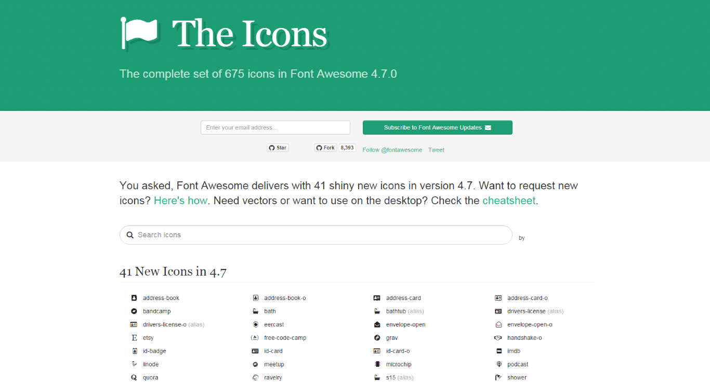
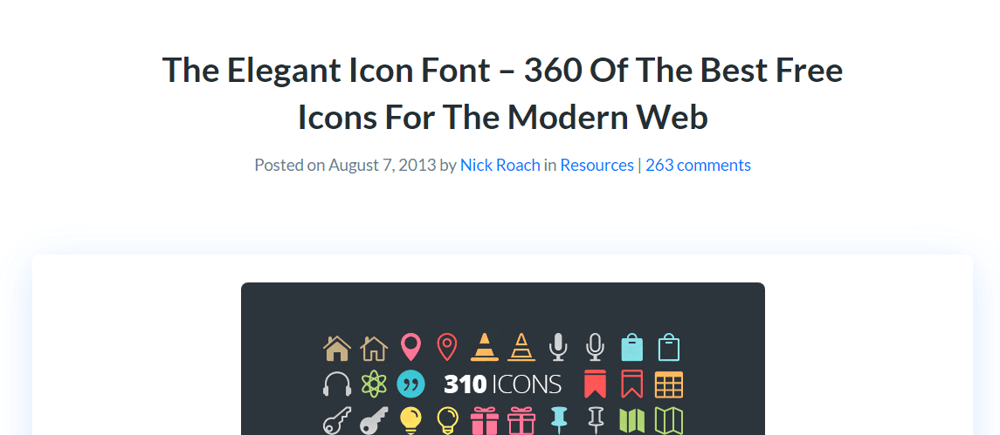
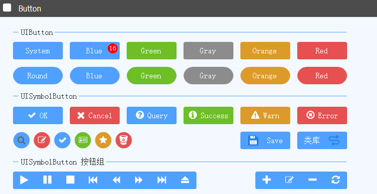
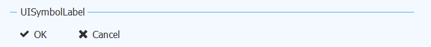
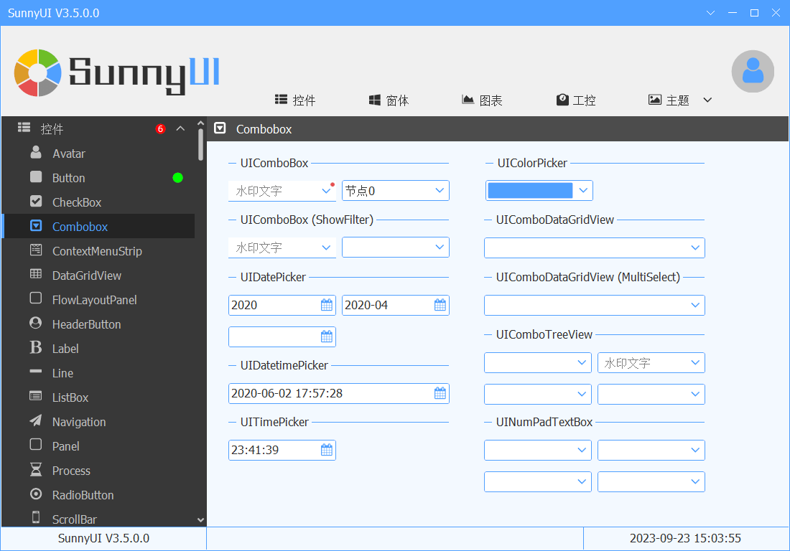

# 字体图标

---

SunnyUI的字体图标目前主要有两个：

- FontAwesome
  [https://fontawesome.com/](https://fontawesome.com/search?m=free&o=r)    
  [https://github.com/FortAwesome/Font-Awesome](https://github.com/FortAwesome/Font-Awesome)    
  
  

  
  
- ElegantIcons.ttf V1.0 https://www.elegantthemes.com/blog/resources/elegant-icon-font
  

  
  
  这两个都是目前Web开发常用的字体图标，SunnyUI经过精心研发，将他们用于.Net Winform开发，省去了到处找图标的麻烦。
  SunnyUI常用字体图标的控件为UISymbolButton和UISymbolLabel:
  
  
  
  
  
  
  字体图标的选择方法是设置UISymbolButton和UISymbolLabel的以下属性：
  Symbol：字体图标（int）
  SymbolSize：字体图标的大小（int）
  
  
  
  
  点击Symbol右侧的按钮：
  
  
  鼠标移到图标上，显示的数字为Symbol字符，点击图标即可设置UISymbolButton的图标。
  
   **.Net6、.Net7，Symbol没有右侧的点击按钮**     
  
  
  
  暂时认为是.Net6、.Net7的Winform的问题，可参考 [https://github.com/dotnet/winforms/issues/6193](https://github.com/dotnet/winforms/issues/6193)    
  建议将项目的运行环境换成.NetFramework。
  
  另外SunnyUI还有多处用到了字体图标。
  例如：
  
  
  左侧边栏的UINavMenu的图标，上侧UINavBar的图标，UICombobox的下拉图标，UIDatePicker的日期选择图标等等。