# 主题

---

## **1、Color 色彩** 

  SunnyUI为了避免视觉传达差异，使用一套特定的调色板来规定颜色，为你所搭建的产品提供一致的外观视觉感受。主要颜色参照Element（[https://element.eleme.cn/](https://element.eleme.cn/)）

  **主色** 
  SunnyUI主要品牌颜色是鲜艳、友好的蓝色。
  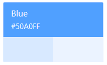

  

  **辅助色** 
  除了主色外的场景色，需要在不同的场景中使用（例如红色表示危险的操作）。
  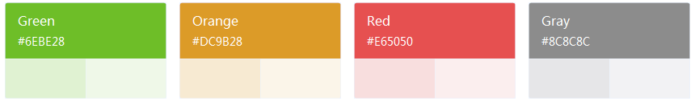

  

  **中性色** 
  中性色用于文本、背景和边框颜色。通过运用不同的中性色，来表现层次结构。
  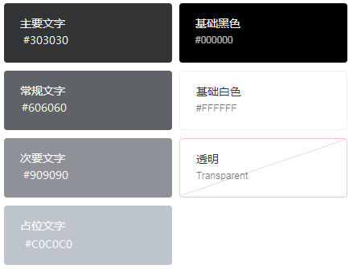

  

## **2、Rect边框** 
  我们对边框进行统一规范，可用于按钮、卡片、弹窗等组件里。

  主要属性如下：
  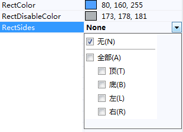

  

  RectColor：边框颜色
  RectDisableColor：控件不可用时边框颜色
  RectSides：边框显示方向
    无：不显示边框
    全部：显示全部边框
    顶：显示顶部边框
    底：显示底部边框
    左：显示左侧边框
    右：显示右侧边框
  注：边框显示和圆角设置相关，如果一侧的边框两端端点为圆角，则此边框必定显示。

## **3、Radius圆角** 
  我们提供了以下几种圆角样式，以供选择。默认圆角大小为5px。

  主要属性如下：
  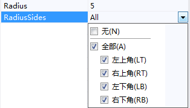

  

  Radius：圆角大小
  RadiusSides：显示四个角圆角的显示与否

  圆角不显示
  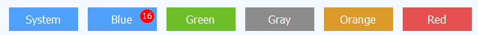

  

  默认圆角大小为5px
  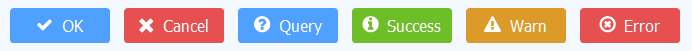

  

  圆角大小与控件高度相等时，显示大圆角
  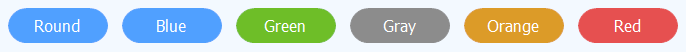

  

  可通过四个角圆角的设置，对控件组合显示
  

  

## **4、Font字体** 
  默认字体为Windows默认字体，中文Windows常见默认字体未宋体，默认字体大小为12。
  全局字体修改见文档: [全局字体设置](/globalfont)
  **注：界面引用字体，请注意字体版权，常见的免费字体有：思源黑体，阿里巴巴普惠体，小米MiSans，鸿蒙HarmonyOS字体等。** 
  **注：微软雅黑为Windows操作系统字体，SunnyUI不包含微软雅黑字体。微软雅黑字体也仅限于屏幕显示，此项功能微软已经取得授权，用户其他操作与SunnyUI无关。如需制作宣传页、视频、广告等请自行取得微软雅黑授权。** 

## **5、Style主题** 
  SunnyUI包含 Element 风格主题 11 个，DotNetBar 主题 3 个，其他主题 2 个，包含主题管理组件 UIStyleManager，可自由切换主题。

  UIStyleManager
  参考SunnyUI.Demo.exe，将UIStyleManager放置在主窗体上，通过选择UIStyleManager的属性Style，或者通过代码设置统一主题风格。
  UIStyleManager.Style = style;

  Style主要属性如下：
  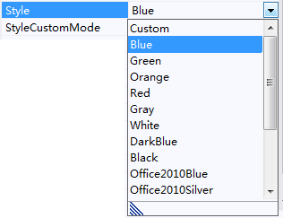

  

  Style：设置主题风格
  StyleCustomMode：是否为自定义主题，设置为False时使用UIStyleManager提供的统一主题风格，设置为Ture时可手动调整控件配色，不受UIStyleManager约束。

  UIStyle.Blue
  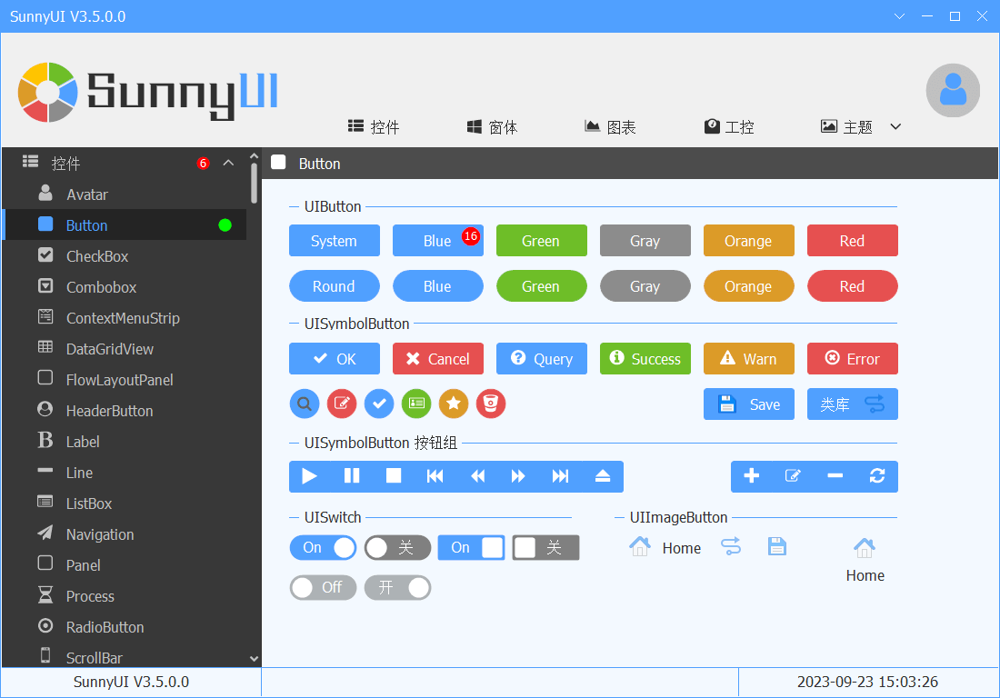

  

  UIStyle.Green
  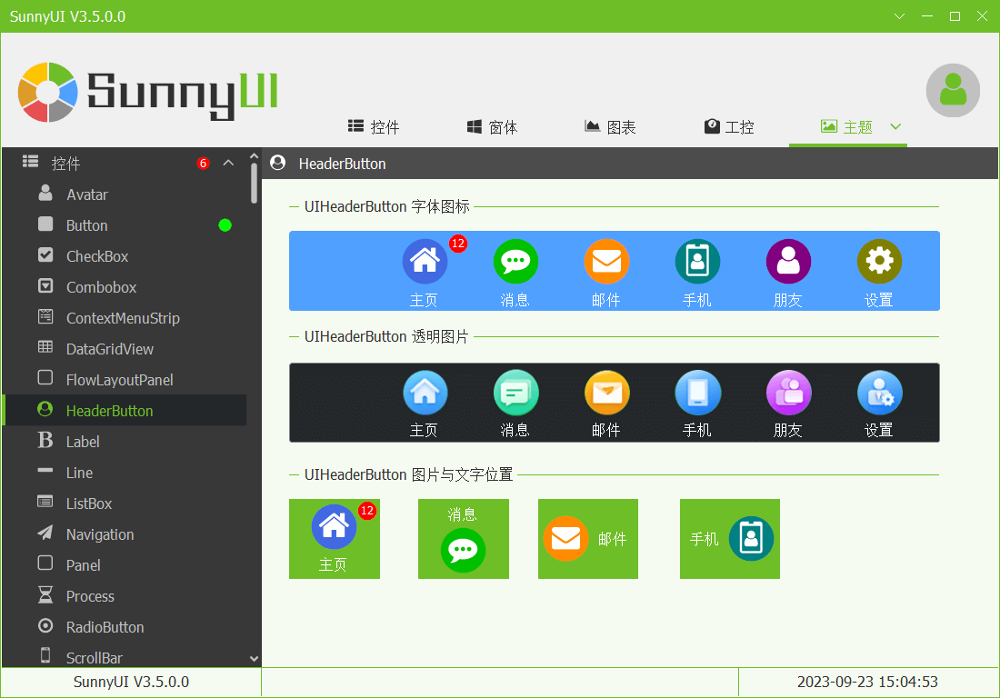

  

  UIStyle.Orange
  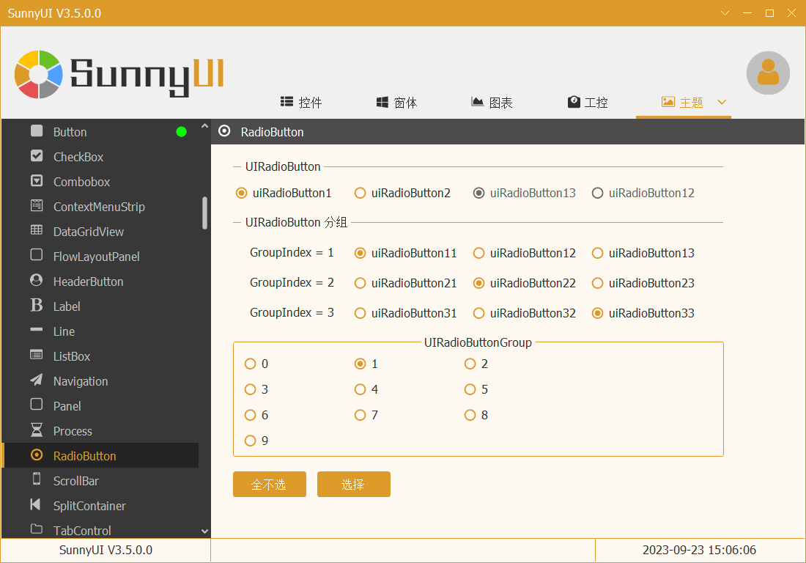

  

  UIStyle.Red
  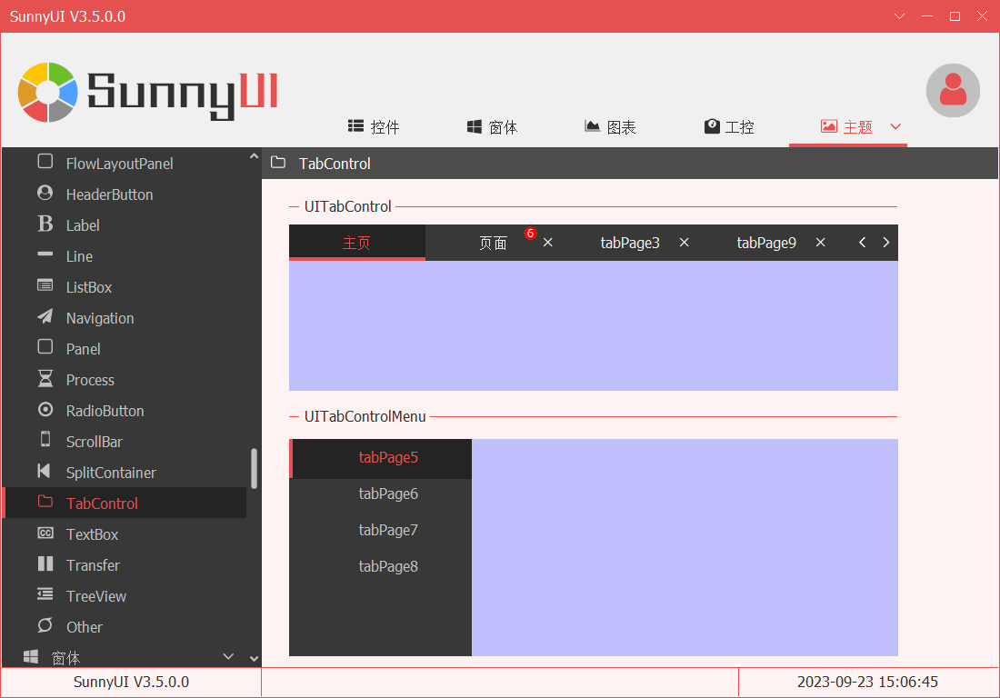

  

  UIStyle.Gray
  

  

  UIStyle.Purple
  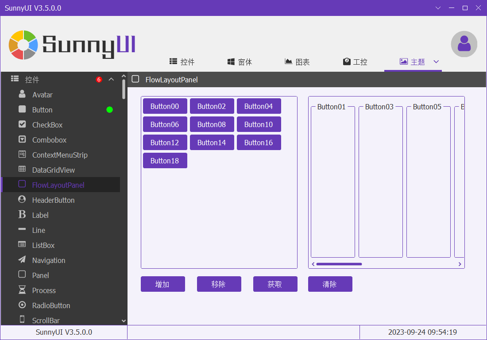

  

  UIStyle.LayuiGreen
  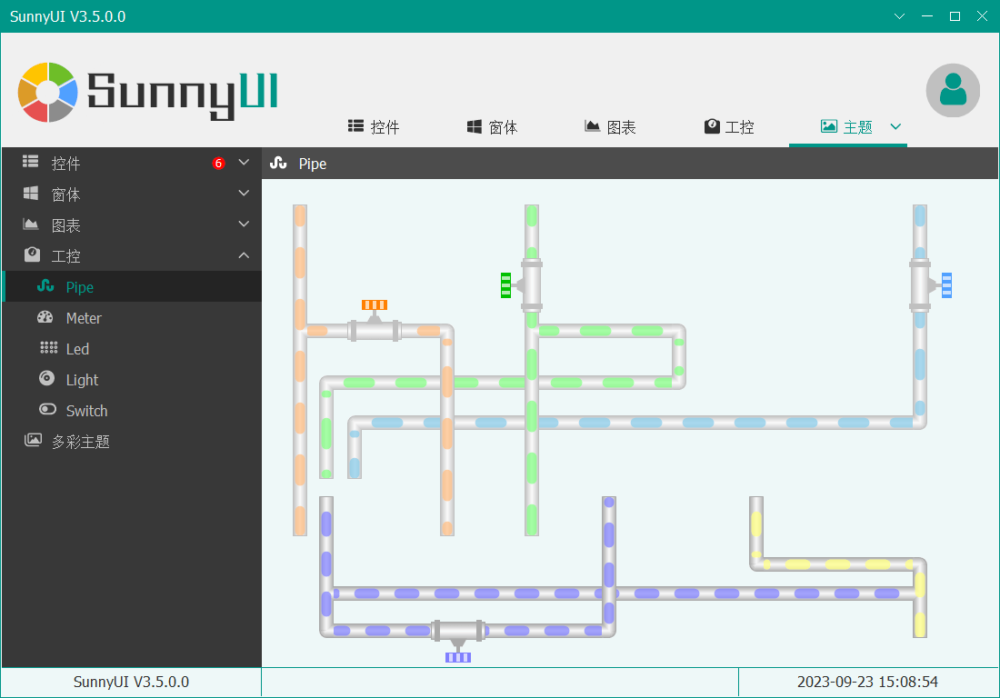

  

  UIStyle.LayuiRed
  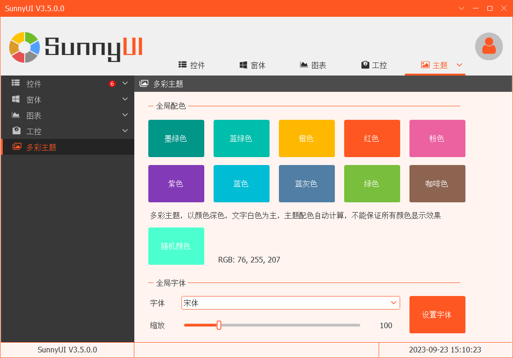

  

  UIStyle.LayuiOrange
  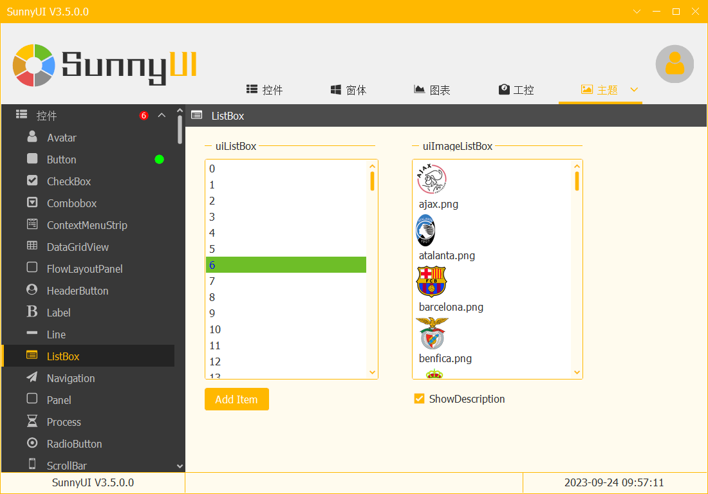

  

  UIStyle.DarkBlue
  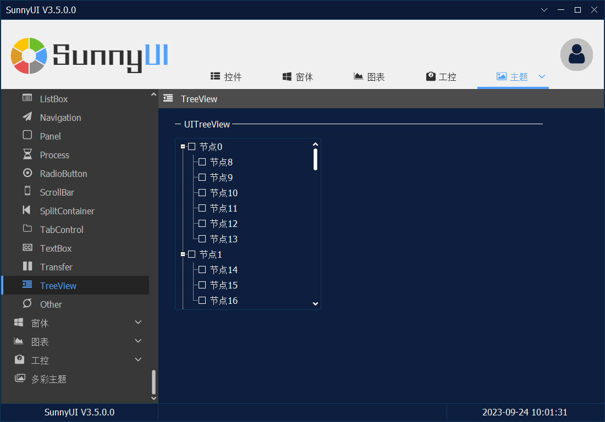

  

  UIStyle.Black
  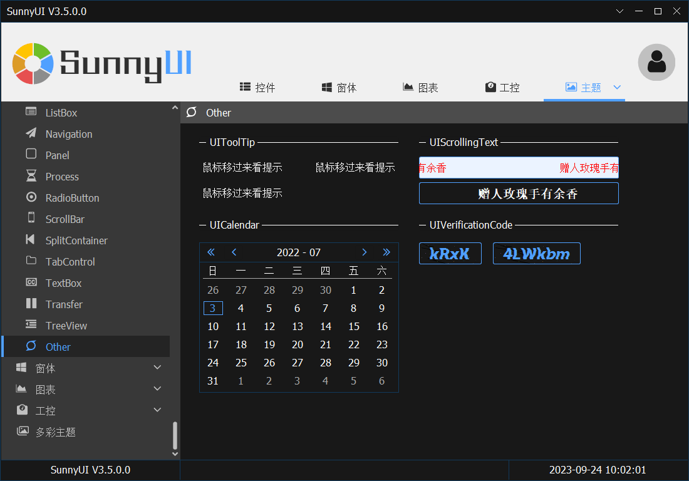

  

  更新了V3.5.0+版本后，可以设置全局字体：[全局字体设置](/globalfont)
  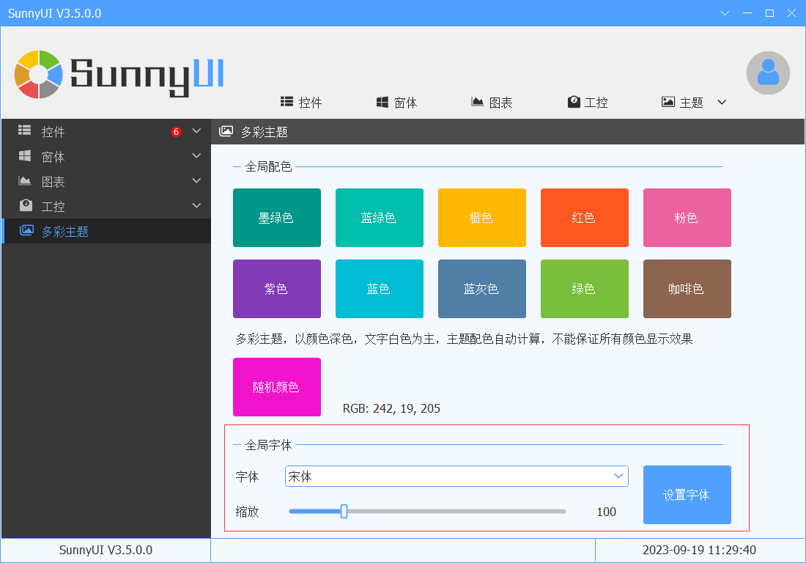

  

  